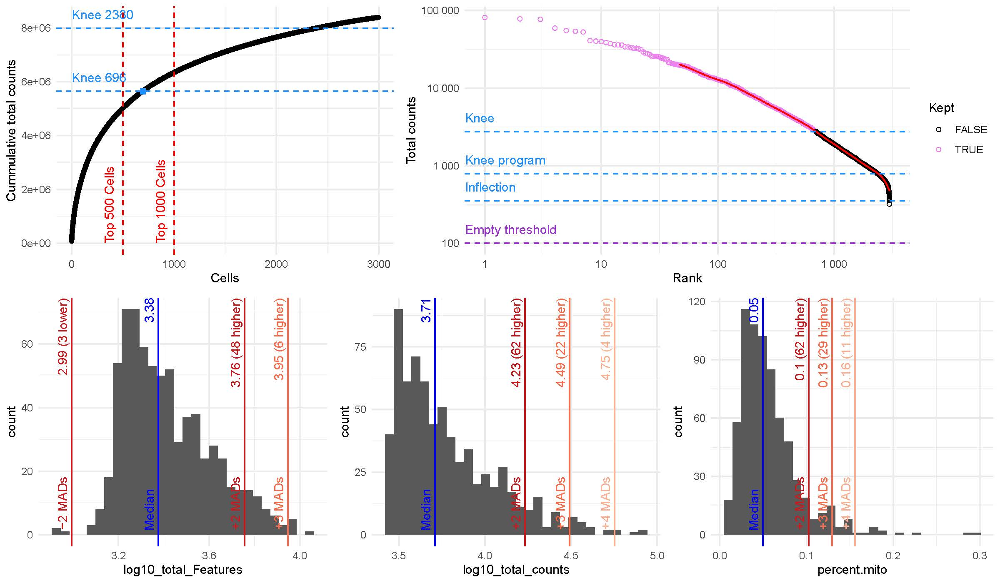
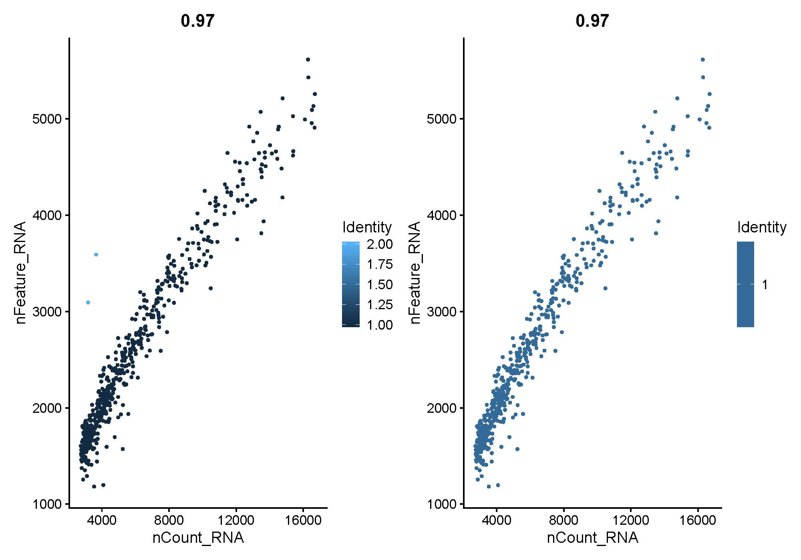
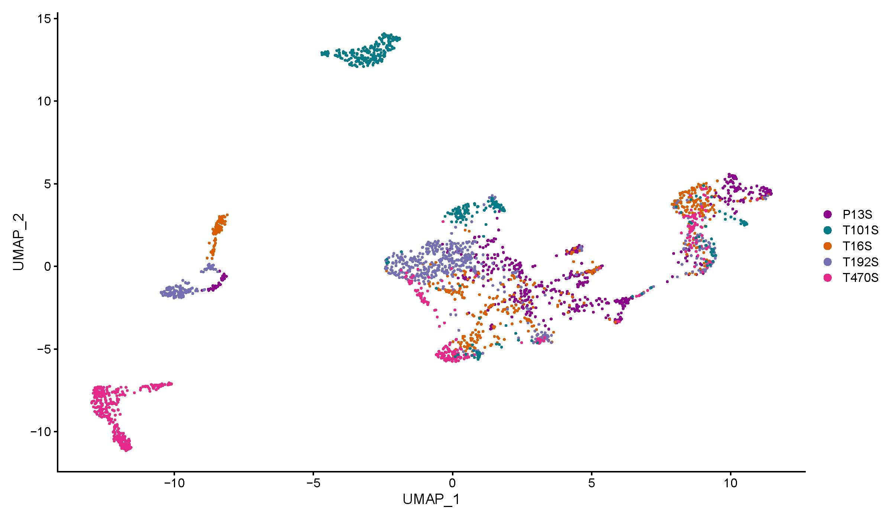
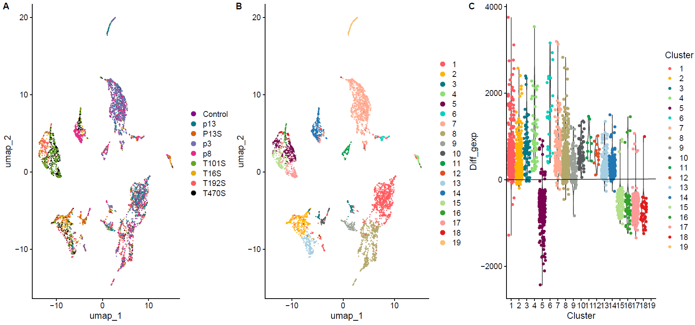
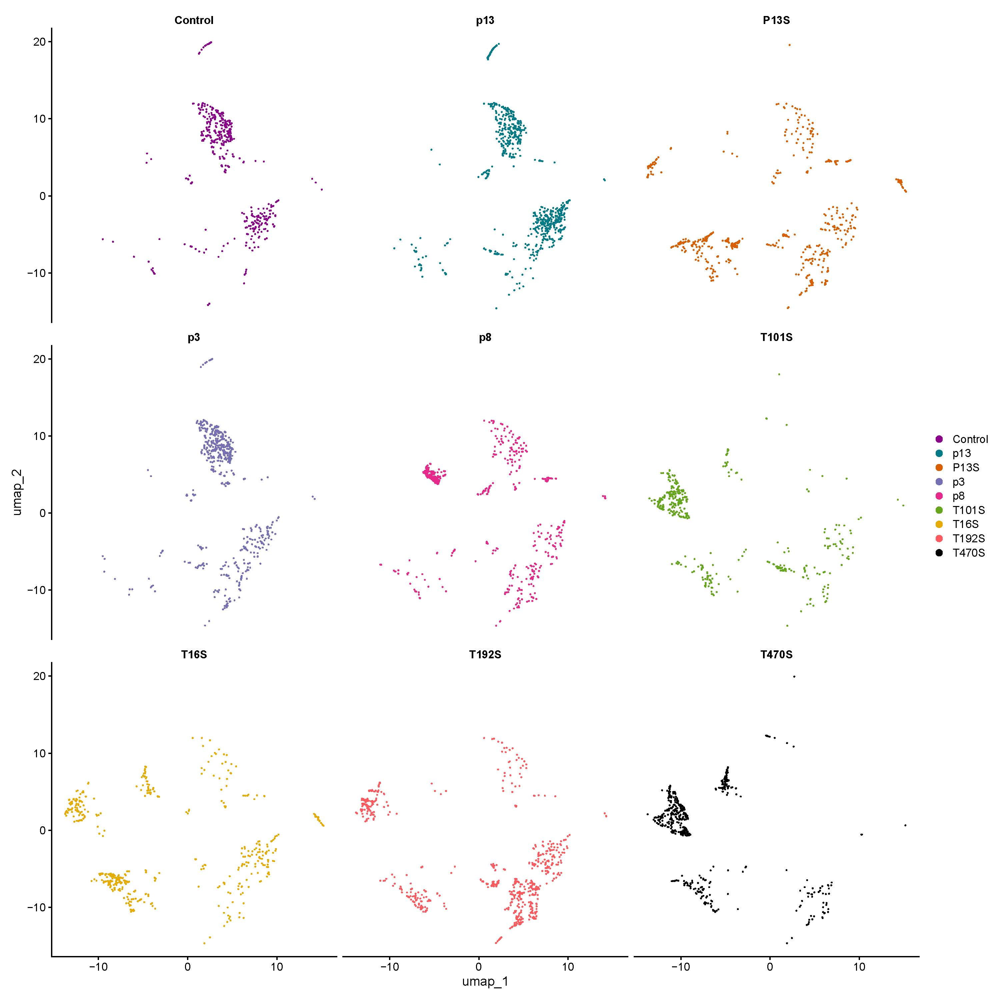
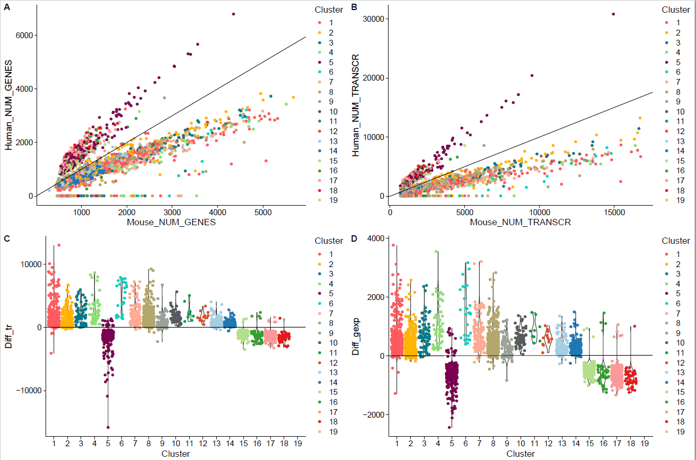
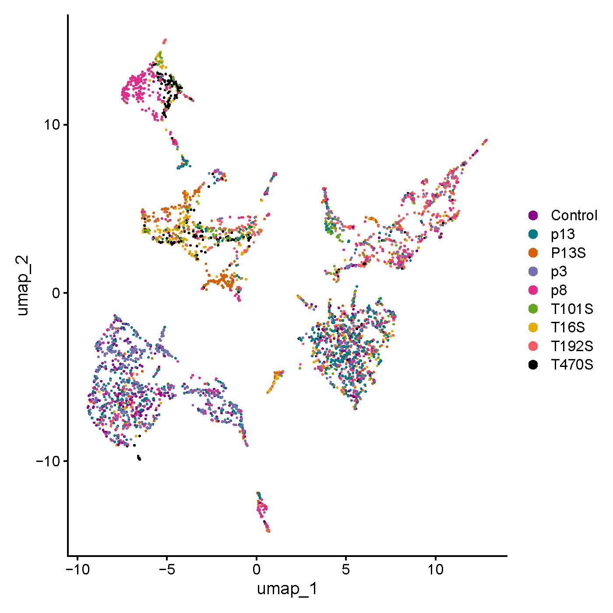
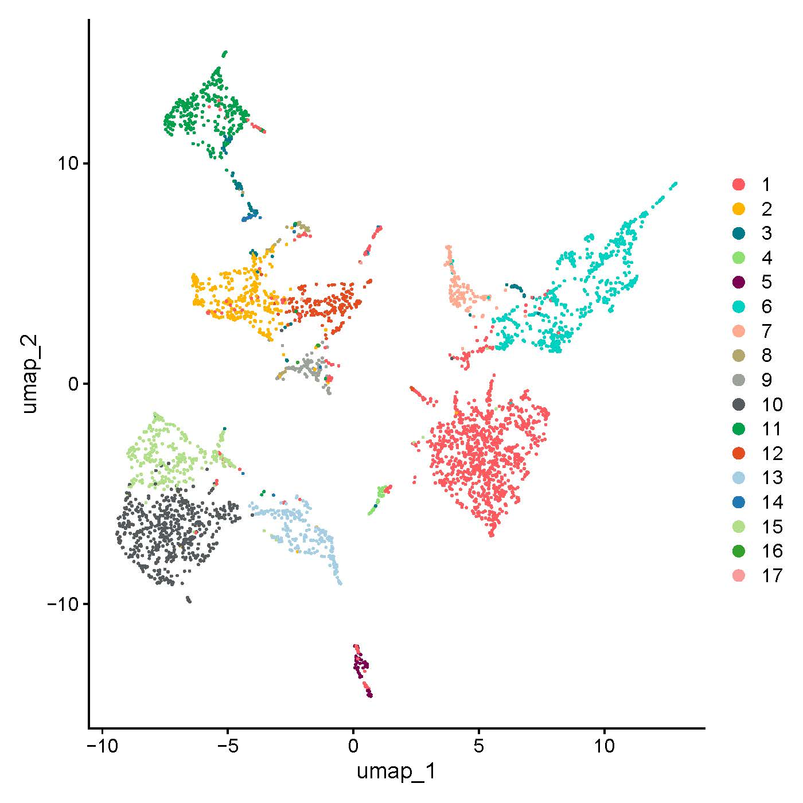
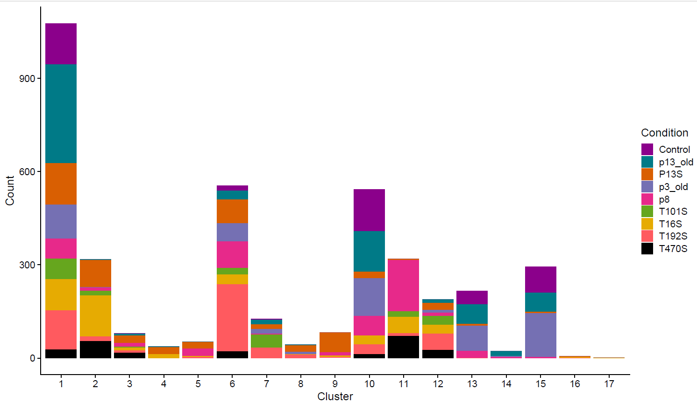
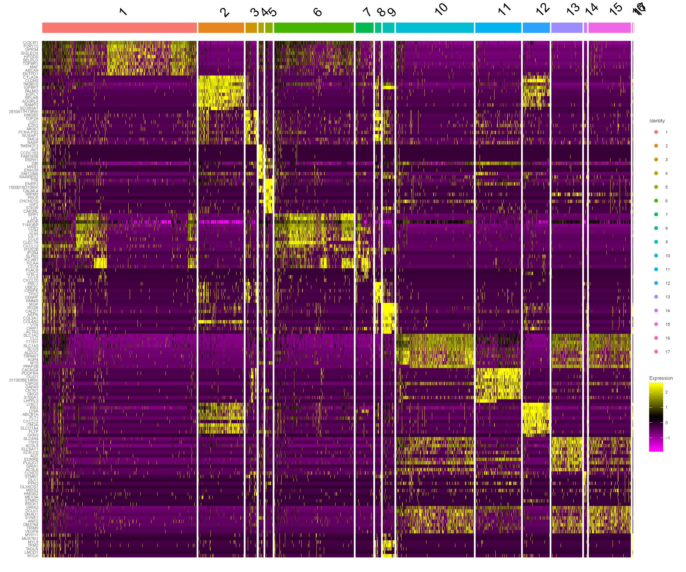

# GBM_TME
Analysis of GBM tumor microenvironment
For this analysis we will use the following TME datasets

# Old data - processed by Suresh in 2016

Mouse brain = Control

P3

P8

P13

*we already have new data from P13 and P3 we may only use P8 and Mouse brain (control) from the old data

# New data processed by Kamil in 2020

for this new data, we need to remove human tumor cells and save those cells in a separate DGEM

file name      /     Real name

P13S_S1_DGE         = P13S  

P16S_S1_DGE         = T16S

P192S_S3_DGE        = T192S

LIH21               = T470S 

LIH22               = T101S

we are still waiting for the following samples, hopefully by next week

T233S

T347S

P3S TMZ treated

P3S control


## Files
/work/projects/esprit/Dropseq_projects/GBMST/

/work/projects/esprit/Dropseq_projects/LIH2/new/


## Preprocess
(Scripts/1.preprocess.R)
Each dataset filtered seperatly.
An example of the filtering of P13S



Extra filtering based on the ratio nCounts/nFeatures


## Map Datasets
(Scripts/3.mapping.R)

### No batch Correction



### Map Datasets using Liger



## Human/Mouse Cells
(Scripts/2.hm_sep.R)



We removed the Clusters (5,15,16,17,18,19) that seems to be human cells.


### Map Datasets using Liger
We used Again Liger to re align the mouse cells only this time.




### Differentially expression between clusters
```
Idents(Seurat)<-Seurat$Cluster
DefaultAssay(Seurat) <- "RNA"
Seurat <-NormalizeData(Seurat)
Seurat <-ScaleData(Seurat)
markers <- FindAllMarkers(Seurat,test.use="MAST",only.pos =T,latent.vars="nCount_RNA",logfc.threshold = 0.1)

top10 <- markers %>% group_by(cluster) %>% top_n(n = 10, wt = abs(avg_logFC))

pdf("DoHeatmap.pdf",width=12,height=10)
DoHeatmap(object = Seurat,features = top10$gene,raster = F)+ 
    theme(text = element_text(size = 6))
dev.off()
```




