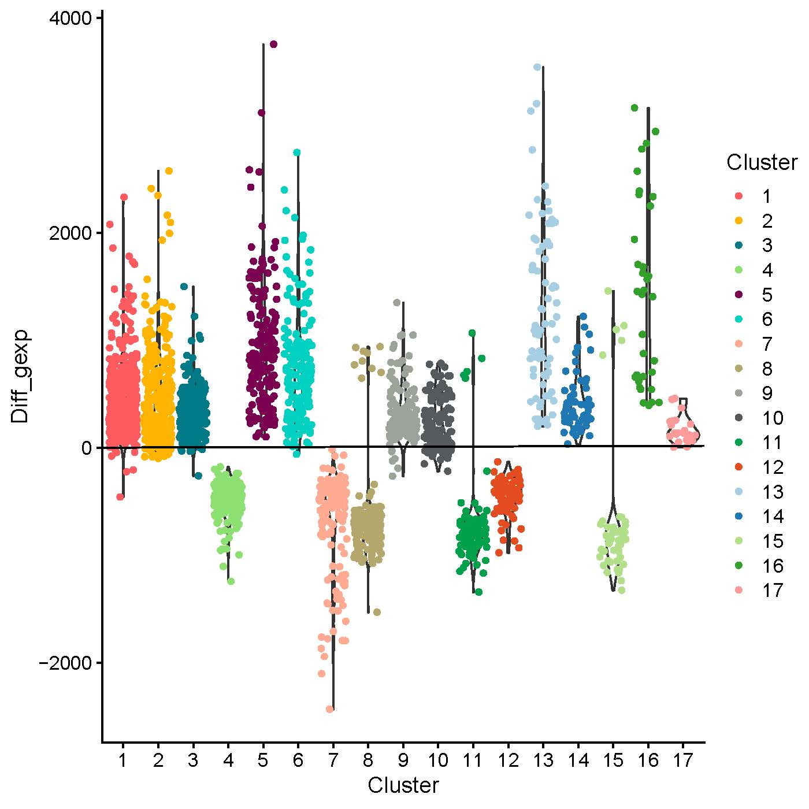

# GBM_TME
Analysis of GBM tumor microenvironment
For this analysis we will use the following TME datasets

# Old data - processed by Suresh in 2016

Mouse brain = Control

P3

P8

P13

*we already have new data from P13 and P3 we may only use P8 and Mouse brain (control) from the old data

# New data processed by Kamil in 2020

for this new data, we need to remove human tumor cells and save those cells in a separate DGEM

file name      /     Real name

P13S_S1_DGE         = P13S  

P16S_S1_DGE         = T16S

P192S_S3_DGE        = T192S

LIH21               = T470S 

LIH22               = T101S

we are still waiting for the following samples, hopefully by next week

T233S

T347S

P3S TMZ treated

P3S control

## Files
/work/projects/esprit/Dropseq_projects/GBMST/

/work/projects/esprit/Dropseq_projects/LIH2/new/

/work/projects/esprit/Dropseq_projects/LIH2/new/

## Preprocess
(Scripts/1.preprocess.R)
Each dataset filtered seperatly.

## Map Datasets
(Scripts/3.mapping.R)

## Human/Mouse Cells
(Scripts/2.hm_sep.R)

